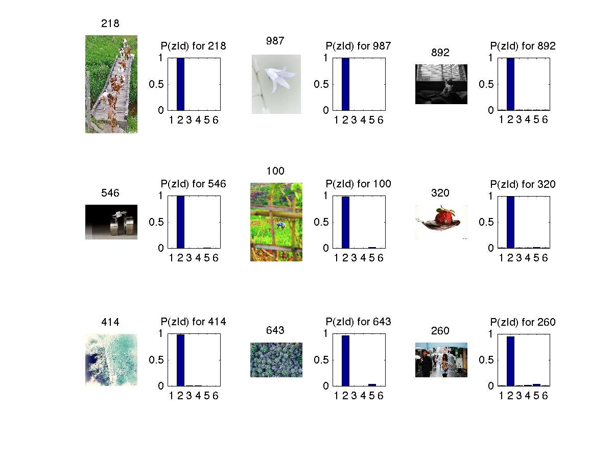

# Image Retrieval
Image retrieval using pLSA 

The dataset used is first 1000 images of MIRFLICKR-25000 [Link] (http://press.liacs.nl/mirflickr/mirflickr25k/mirflickr25k.zip)  
It is an unsupervised learning algorithm by Probabilistic Latent Semantic Analysis. Check the [paper](http://www.cs.bham.ac.uk/~pxt/IDA/plsa.pdf) for more.   

Coarse color histogram quantized to 1000 levels is used as a feature. The 1000 levels used are [here]{https://github.com/harshkn/ImageRetrieval/blob/master/colors.csv)   

pLSA can be also applied to text, example it can cluster a series of articles into various topics like sports, politics, movies etc. 

In this application the 1000 images are used to learn the topic model based on the coarse color histogram. Later the learnt model is used to retrieve k number of most similar images. Similar image here means, which are similar by topics. For this case 6 topics are chosen.
####Learnt 6 topic model is 

####Some images from each topic 

###Retrieval Example
####Similar images retrieved based on 1st image(titled 109) is 

####Similar images retrieved based on 1st image(titled 59) is 

####Similar images retrieved based on 1st image(titled 44) is 

